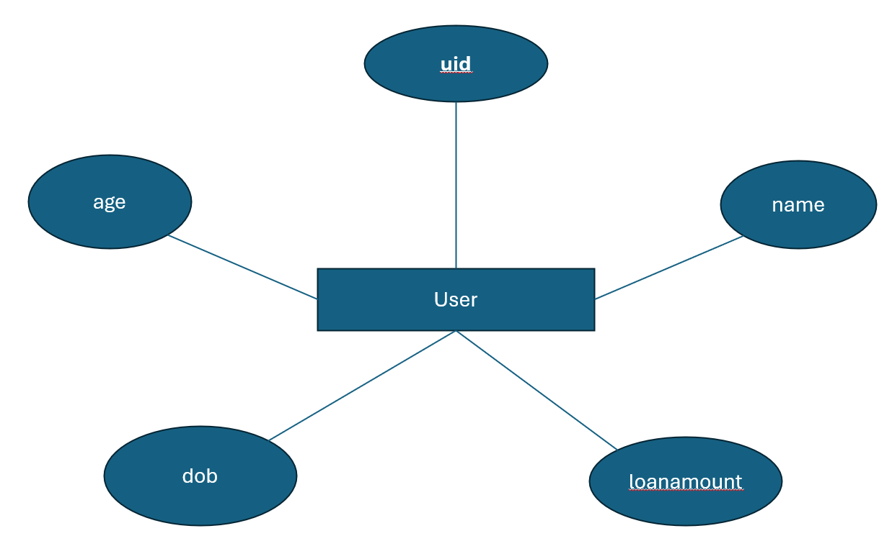

# Ex02 Django ORM Web Application
## Date: 28/10/2024

## AIM
To develop a Django application to store and retrieve data from a bank loan database using Object Relational Mapping(ORM).

## ENTITY RELATIONSHIP DIAGRAM



## DESIGN STEPS

### STEP 1:
Clone the problem from GitHub

### STEP 2:
Create a new app in Django project

### STEP 3:
Enter the code for admin.py and models.py

### STEP 4:
Execute Django admin and create details for 10 books

## PROGRAM
```
models.py
from django.db import models
from django.contrib import admin
class User(models.Model):
   uid=models.CharField(max_length=30,primary_key="uid")
   name=models.CharField(max_length=100)
   loanamount=models.IntegerField()
   dob=models.DateField()
   age=models.IntegerField()
class UserAdmin(admin.ModelAdmin):
   list_display=('uid','name','loanamount','dob','age')

admin.py
from django.contrib import admin
from.models import User,UserAdmin
admin.site.register(User,UserAdmin)
```


## OUTPUT


## RESULT
Thus the program for creating a database using ORM hass been executed successfully
